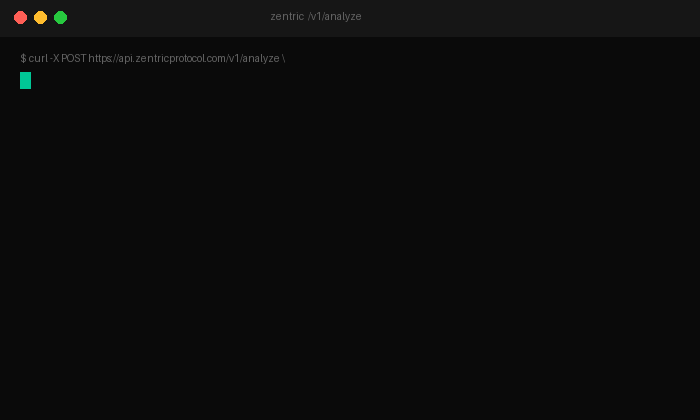

<div align="center">


<br/><br/>

# ZENTRIC PROTOCOL

**Prompt injection detection & PII anonymization with a signed audit trail — for LLM apps and AI agents.**

[](https://zentricprotocol.com)
[](https://zentricprotocol.com)
[](https://zentricprotocol.com)
[](https://zentricprotocol.com)
[](https://zentricprotocol.com)
[](https://zentricprotocol.com)

<br/>

*Every prompt, RAG chunk and tool output inspected before it reaches your model — deterministic `CLEARED / ANONYMIZED / BLOCKED` verdicts with a signed audit record (SHA-256 + UUID + UTC) per request.*  
*Detection tells you what happened. **The audit record is what you show your auditor** — GDPR Art. 30 evidence today, EU AI Act readiness tomorrow.*

<br/>

[**→ Get API key (free, 10,000 req/mo)**](https://zentricprotocol.com#api-access) · [**Quickstart**](https://zentricprotocol.com/quickstart) · [**Integrity Report v1.0 (PDF)**](https://zentricprotocol.com/integrity-report.pdf)

</div>

<div align="center">
<br/>



<br/>
<sub>A real prompt injection attempt. Caught in <0.1ms. Your model never sees it.</sub>
<br/><br/>

</div>

---

## Repository Scope & Commercial License

This repository exists for **transparency and contribution** — not as a deployable alternative to the hosted service.

| What's in this repo | What's not in this repo |
|---|---|
| Authentication middleware (`/middleware`) | IntegrityGuard detection engine |
| Stripe webhook handler (`/api/webhooks`) | PrivacyGuard PII detection engine |
| Supabase schema & migrations (`/supabase`) | Signature database (22 injection vectors) |
| API interface contracts & response shapes | Model weights and training data |
| Landing page & documentation (`index.html`) | Audit record signing infrastructure |

**Cloning this repository does not give you access to the Zentric processing service.** The detection engine that inspects prompts, detects PII, and generates signed audit reports runs on Zentric's infrastructure and requires an active license.

### Why publish the middleware?

Because trust is infrastructure. You should be able to verify how authentication works, how your API key is validated, and how subscription state is checked before your requests reach the engine. We believe in auditability at every layer — including our own enforcement code.

### Contributions welcome

We accept contributions to the middleware, webhook handler, and Supabase schema. Open a PR or file an issue. For security-related contributions, see the [Security](#security) section.

### Getting access

| Tier | Price | Requests | Start |
|---|---|---|---|
| **Free** | Free | 10,000/mo | [Get API key →](https://zentricprotocol.com#api-access) |
| **Indie** | $29/mo | 25,000/mo | [See pricing →](https://zentricprotocol.com#pricing) |
| **Team** | $99/mo | 100,000/mo | [See pricing →](https://zentricprotocol.com#pricing) |
| **Scale** | $499/mo | 500,000/mo | [See pricing →](https://zentricprotocol.com#pricing) |
| **Enterprise** | Custom | Unlimited | [Contact →](mailto:core@zentricprotocol.com) |

---

## What is Zentric Protocol?

Zentric Protocol is an **infrastructure integrity layer** for AI systems. It sits between your application and your LLM, examining every signal — prompts, responses, user inputs — and returning a cryptographically-signed verdict before execution continues.

It is not a filter. It does not guess. It applies deterministic rules across a standardized pipeline and returns a structured, auditable JSON report for every request.

```
Input Signal
     │
     ▼
┌─────────────────────────────────────────┐
│           ZENTRIC PROTOCOL              │
│                                         │
│  ┌─────────────┐  ┌─────────────────┐  │
│  │IntegrityGuard│→│  PrivacyGuard   │  │
│  │ 22 injection │  │  12 PII types   │  │
│  │  signatures  │  │  7 languages    │  │
│  └─────────────┘  └────────┬────────┘  │
│                             ▼           │
│                    ┌──────────────┐     │
│                    │ ZentricReport│     │
│                    │ UUID+SHA-256 │     │
│                    │  GDPR Art.30 │     │
│                    └──────────────┘     │
└─────────────────────────────────────────┘
     │
     ▼
Verdict + Certificate → Your System
```

---

## Performance

Zentric uses **deterministic signature matching** — not an ML classifier. Every block is a known pattern match, which means **100% precision on known patterns** and **zero false positives**: nothing is ever blocked unless it matches a catalogued signature. Verdicts are returned in **sub-millisecond** time (no model in the hot path), so the same input always produces the same verdict.

Any published metric is reproducible: run `npm run benchmark` (`benchmarks/run.mjs`) against the public `deepset/prompt-injections` dataset to verify the numbers yourself.

---

## The Three Modules

### 01 · IntegrityGuard
Detects prompt injection, jailbreak attempts, and instruction overrides before they reach your LLM.

- 22 catalogued injection signatures
- 7 supported languages (EN, ES, FR, DE, PT, ZH, JA)
- Deterministic multilingual signature matching — no ML model in the verdict path
- Mean server-side processing: **<0.1ms** *(sub-millisecond; no model in the hot path)*

### 02 · PrivacyGuard
Identifies and anonymizes PII in prompts and responses. Regional standards treated as first-class entities.

- 12 PII entity types, format-validated (Luhn, IBAN mod-97, mod-11, NIF/NIE checksum): SSN, NIF, CPF, CURP, IBAN, SWIFT, passport, email, phone, and more
- Regional pattern recognition (EU, US, LATAM)
- Anonymization operators: redact, mask, tokenize, pseudonymize

### 03 · ZentricReport
Every request that passes through the protocol generates a signed, immutable audit record.

```json
{
  "report_id": "zp_01HXYZ...",
  "uuid": "f47ac10b-58cc-4372-a567-0e02b2c3d479",
  "timestamp_utc": "2026-05-14T22:00:00.000Z",
  "sha256": "e3b0c44298fc1c149afb...",
  "verdict": "CLEARED",
  "integrity": {
    "injection_detected": false,
    "signatures_matched": [],
    "confidence": null
  },
  "privacy": {
    "pii_detected": true,
    "entities": [
      { "type": "EMAIL", "action": "REDACTED", "position": [42, 61] }
    ]
  },
  "compliance": {
    "audit_record": true,
    "ccpa": true,
    "eu_ai_act_s52": true
  },
  "latency_ms": 0.05
}
```

---

## API Reference

### Authentication

```bash
curl -X POST https://api.zentricprotocol.com/v1/analyze \
  -H "Authorization: Bearer zp_live_..." \
  -H "Content-Type: application/json" \
  -d '{
    "input": "Your prompt or user input here",
    "modules": ["integrity", "privacy"],
    "options": {
      "anonymize": true,
      "language": "auto"
    }
  }'
```

### Response

```json
{
  "status": "ok",
  "verdict": "CLEARED",
  "report": { ... },
  "anonymized_input": "Your prompt or user input here",
  "latency_ms": 0.05
}
```

### Verdict States

| Verdict | Description |
|---|---|
| `CLEARED` | Input passed all checks. Safe to forward to LLM. |
| `BLOCKED` | Injection or high-risk pattern detected. Reject. |
| `ANONYMIZED` | PII found and redacted. Anonymized input returned. |

### SDKs

| Language | Status |
|---|---|
| Python | `pip install zentricprotocol` *(coming Q3 2026)* |
| Node.js | `npm install @zentricprotocol/sdk` *(coming Q3 2026)* |
| REST API | **Available now** |

---

## Compliance Coverage

Zentric Protocol is designed from the ground up for regulated AI deployments.

| Standard | Coverage |
|---|---|
| **GDPR Art. 30** | Reproducible audit record per request — one component of an Art.30 documentation strategy |
| **GDPR Art. 25** | Privacy by design — anonymization as default |
| **CCPA §1798.100** | Consumer data identification and processing record |
| **EU AI Act §52** | Transparency obligations resolved at infrastructure level |

---

## Pricing

| Tier | Price | Requests | Use Case |
|---|---|---|---|
| **Free** | Free | 10,000/mo | Test the protocol end-to-end, no credit card |
| **Indie** | $29/mo | 25,000/mo | Solo developers shipping their first AI feature |
| **Team** | $99/mo | 100,000/mo | Small teams running AI in production |
| **Scale** | $499/mo | 500,000/mo | High-volume pipelines and multi-agent systems |
| **Enterprise** | Custom | Unlimited | Regulated industries, EU data residency, dedicated SLA |

[→ See plans](https://zentricprotocol.com#pricing) · [→ Get API key](https://zentricprotocol.com#api-access) · [→ Contact for Enterprise](mailto:core@zentricprotocol.com)

---

## Architecture Principles

**Deterministic.** The same input always produces the same verdict. No probabilistic black boxes in the critical path.

**Stateless.** The protocol does not store your data. Each request is processed and returned. The audit record is yours.

**Composable.** Deploy the full stack, a single guard, or wire only the audit layer into existing infrastructure.

**Auditable.** Every verdict is signed with SHA-256, timestamped in UTC, and assigned a UUID. Your compliance team will thank you.

---

## For Agent Pipelines

Agent attacks don't arrive through the chat input. They arrive through tool call responses, RAG chunks, and memory retrievals — any external content that enters the prompt window. Your system prompt doesn't protect you here: it doesn't run until after the input is already parsed.

Wire Zentric at every ingestion point, not just on user messages:

- **LLM input** — user messages before they reach the model
- **Tool output** — external API responses before they re-enter the context window
- **RAG retrieval** — document chunks before they are assembled into the prompt
- **Memory reads** — stored context before it is injected into the next turn

One POST to `/v1/analyze`. The verdict comes back in sub-millisecond time. The agent continues or halts based on the result. Nothing else changes in your pipeline.

```bash
curl -X POST https://api.zentricprotocol.com/v1/analyze \
  -H "Authorization: Bearer zp_live_..." \
  -H "Content-Type: application/json" \
  -d '{"input": "<tool_output_or_rag_chunk_here>", "modules": ["integrity", "privacy"]}'
```

---

## MCP Server — Claude Desktop Integration

Zentric Protocol ships a native **Model Context Protocol (MCP) server** that integrates directly with Claude Desktop and any MCP-compatible agent runtime.

### What it does

The MCP server exposes Zentric's detection engine as a native MCP tool. When wired into Claude Desktop, the agent automatically calls `analyze_prompt` before sending any input to the LLM — user messages, tool responses, RAG chunks, and memory retrievals are all checked.

### MCP Tool exposed

```
analyze_prompt(text: string) -> ZentricReport
```

Returns: `verdict` (CLEARED / BLOCKED), `risk_score`, matched `signatures`, `pii_entities`, `report_hash` (SHA-256), `latency_ms`.

### Install via npm

```bash
npx zentric-protocol-mcp
```

### Claude Desktop configuration

Add to your `claude_desktop_config.json`:

```json
{
  "mcpServers": {
    "zentric-protocol": {
      "command": "npx",
      "args": ["zentric-protocol-mcp"],
      "env": {
        "ZENTRIC_API_KEY": "your_api_key"
      }
    }
  }
}
```

Get your API key at [zentricprotocol.com/quickstart](https://zentricprotocol.com/quickstart) — free tier is 10,000 requests/month, no credit card required.

### MCP server source

The MCP server source code is in [`/mcp-server`](./mcp-server). It is built with the Model Context Protocol SDK and published to npm as [`zentric-protocol-mcp`](https://www.npmjs.com/package/zentric-protocol-mcp).

---

## Security

We take the security of this protocol seriously. If you discover a vulnerability, please report it responsibly.

- **Email:** [core@zentricprotocol.com](mailto:core@zentricprotocol.com)
- **Subject:** `[SECURITY] <brief description>`
- **Response SLA:** 48 hours acknowledgement, 7 days resolution target

We do not operate a public bug bounty program at this time. Responsible disclosure is acknowledged in our changelog.

---

## Roadmap

- [x] IntegrityGuard v1.0 — 22 signatures, 7 languages
- [x] PrivacyGuard v1.0 — 12 PII types, EU/US/LATAM
- [x] ZentricReport v1.0 — SHA-256, UUID, GDPR Art.30
- [x] REST API (production)
- [ ] Python SDK — Q3 2026
- [ ] Node.js SDK — Q3 2026
- [ ] Streaming support (SSE) — Q3 2026
- [ ] Webhook callbacks — Q4 2026
- [ ] Self-hosted deployment option — 2027

---

## Contact

| Channel | |
|---|---|
| General | [core@zentricprotocol.com](mailto:core@zentricprotocol.com) |
| Enterprise | [core@zentricprotocol.com](mailto:core@zentricprotocol.com) |
| Security | [core@zentricprotocol.com](mailto:core@zentricprotocol.com) |
| X / Twitter | [@ZentricProtocol](https://x.com/ZentricProtocol) |
| LinkedIn | [Zentric Protocol](https://www.linkedin.com/company/zentricprotocol/) |

---

<div align="center">

**Zentric Protocol · Infrastructure Integrity for the AI Era**

[zentricprotocol.com](https://zentricprotocol.com) · © ZP MMXXVI · v1.0.0

*Built for CTOs who know that trust is infrastructure, not a feature.*

</div>
